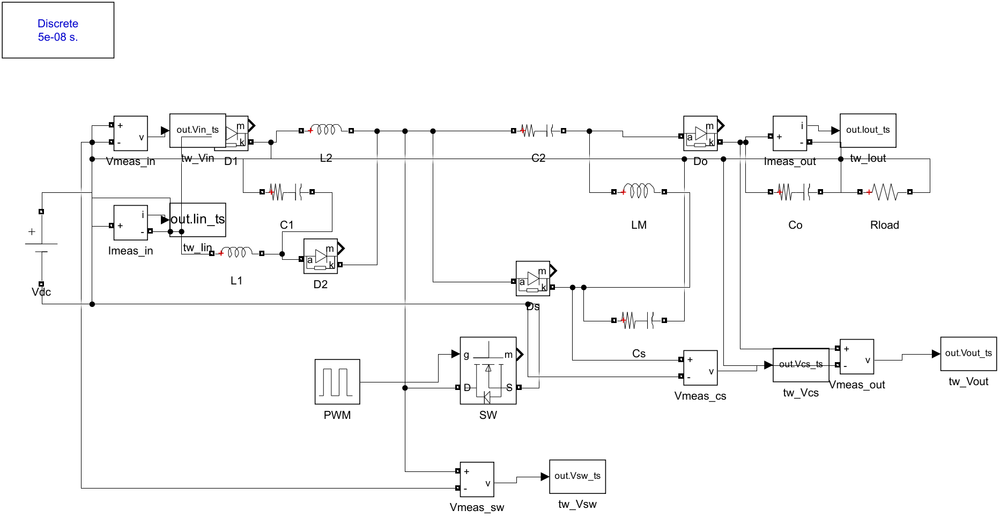
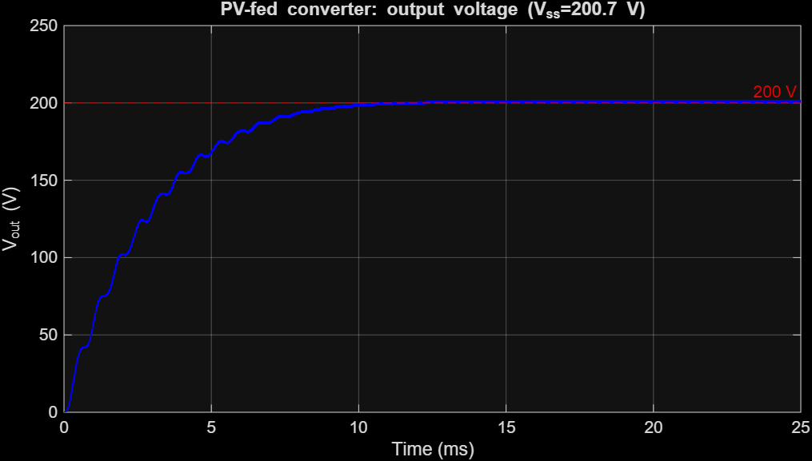
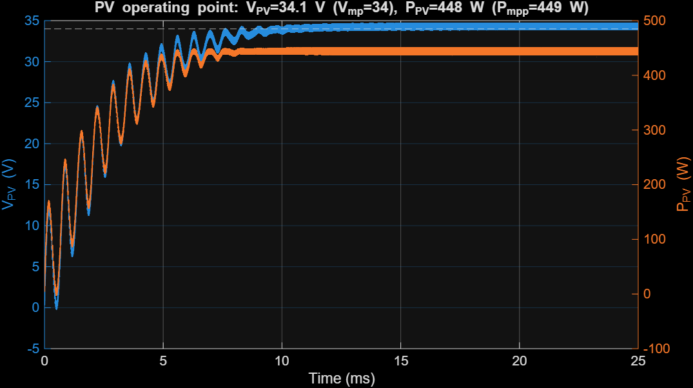
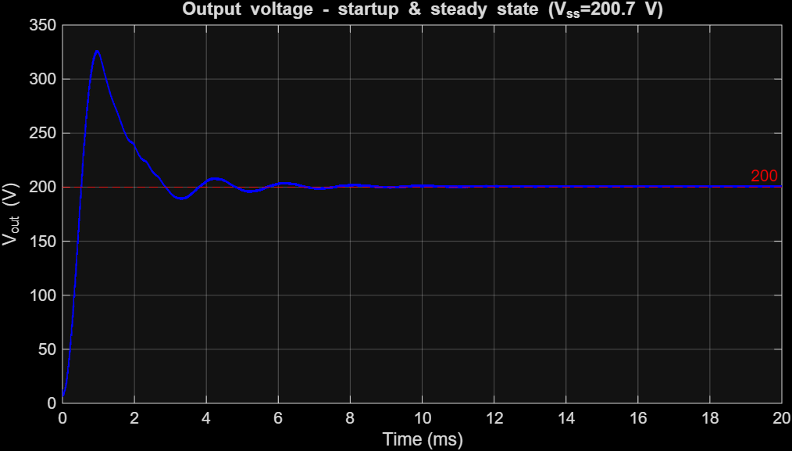
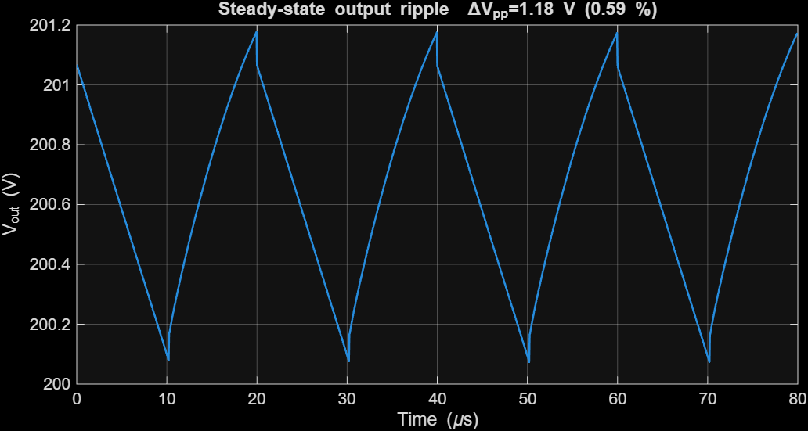
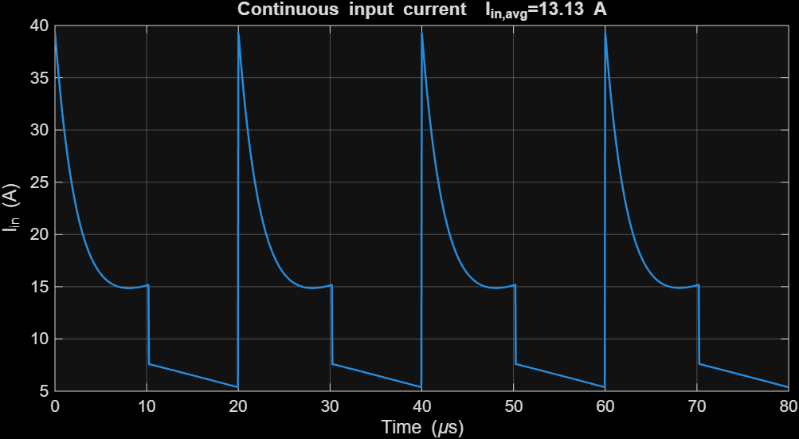
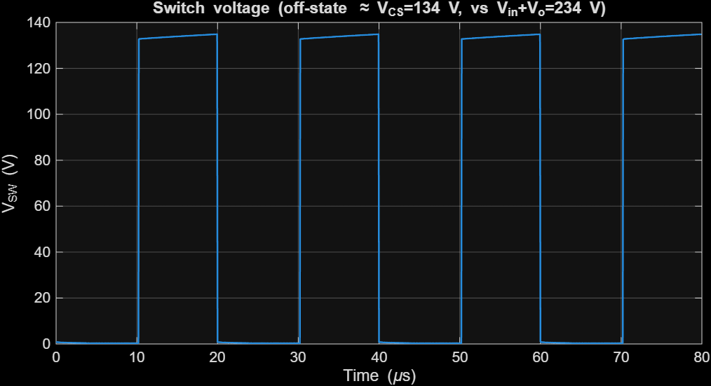
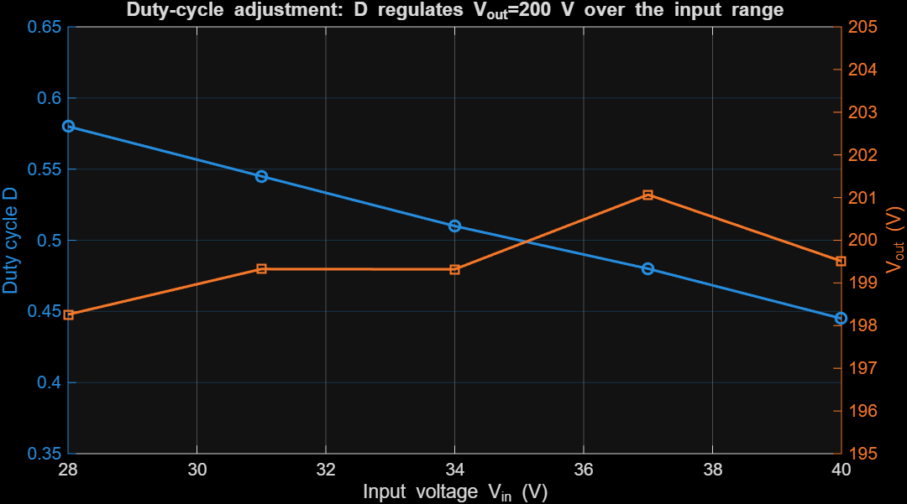
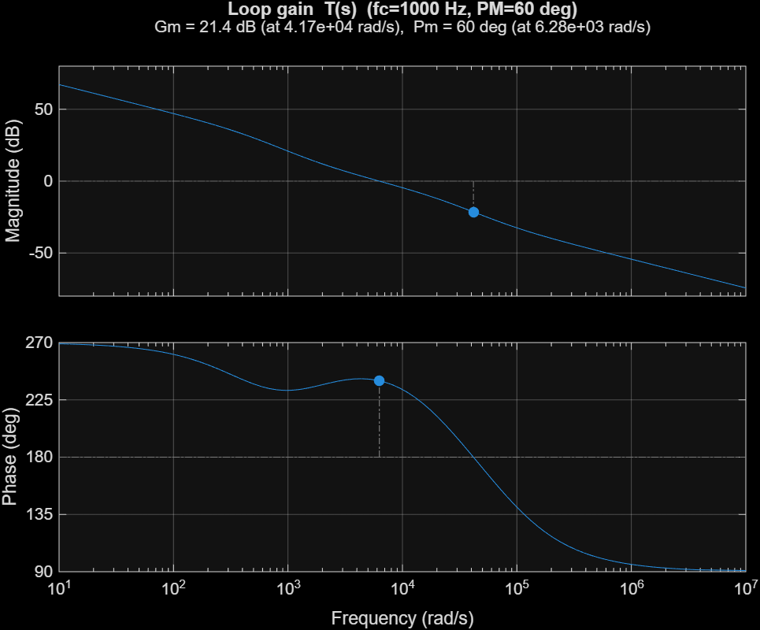
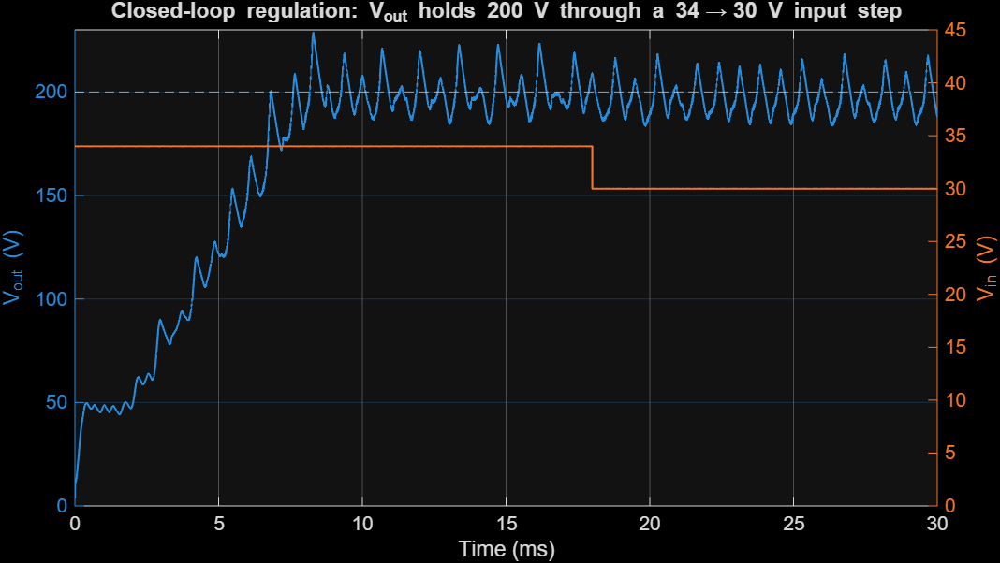

# Design and Analysis of a High-Gain Switched Inductor-Capacitor SEPIC Converter for Photovoltaic Applications

**EEE4440 – Power Electronics in Energy Systems — Final Project Report**

Bahçeşehir University · Faculty of Engineering and Natural Sciences · Department of Electrical and Electronics Engineering

**Group Members**

| Name | Student ID |
|---|---|
| Baran Şakir Atlı | 2003998 |
| Tuğrul Arslan | 2004060 |
| Deniz Bayrak | 2103588 |
| Defne Ceylan | 2200666 |

*Date: June 2026*

---

## Abstract

This report presents the complete design and analysis of a high-gain, non-isolated **switched inductor-capacitor (SI-C) SEPIC** DC–DC converter intended to interface a single photovoltaic (PV) module to a 200 V DC bus. The converter steps the panel voltage (open-circuit voltage *V*oc ≈ 40 V) up to **five times *V*oc (200 V)** while delivering the required **2 A (400 W)** output. The topology, gain relation *M* = 2(1+D)/(1−D), and the decision to avoid a coupled inductor are grounded in the group's prior literature review of recent (2023–2025) high-gain SEPIC research. The work covers topology justification, full analytical design calculations, a MATLAB/Simulink (Simscape Electrical) simulation for both a PV source and a variable DC source, and a realistic analog PWM control circuit. The simulation confirms the design: from a PV array the converter operates the panel at **99.9 % of its maximum-power point** and delivers a regulated **200.7 V / 2.0 A** output with **0.55 % voltage ripple** at **≈ 90 % efficiency**; the simulated switch voltage stress (133 V) matches the analytical value 2*V*in/(1−D) and is far below the *V*in+*V*o = 234 V of a conventional SEPIC.

---

## 1. Introduction

Photovoltaic modules deliver a low, weather-dependent DC voltage (typically 20–45 V at the maximum-power point for a single module), whereas DC microgrids, storage links and grid-tied inverters require a stable 200–400 V DC bus. A high step-up DC–DC stage is therefore mandatory at the module level.

The **single-ended primary-inductor converter (SEPIC)** is an attractive interface because it provides (i) non-inverted step-up/step-down operation and (ii) **continuous input current**, which reduces PV-side current ripple and improves the effective utilisation of the panel. However, the classical SEPIC voltage gain *V*o/*V*in = D/(1−D) cannot economically reach the 5–6× ratio required here: a 5.9× ratio would demand a duty cycle of D ≈ 0.855, where conduction losses, diode reverse-recovery, and component voltage stress become prohibitive and the real (lossy) gain saturates well below the ideal curve.

This project therefore designs a **high-gain SEPIC variant** that reaches the required ratio at a moderate duty cycle. The remainder of the report (i) motivates the design from the literature, (ii) justifies the chosen topology, (iii) derives the full analytical design, (iv) validates it in MATLAB/Simulink, and (v) presents a realistic analog control circuit.

### 1.1 Design Requirements and Specifications

| Quantity | Symbol | Value | Notes |
|---|---|---|---|
| PV open-circuit voltage | *V*oc | 40 V | single 60-cell-format module (~450 W class) |
| PV max-power voltage | *V*mp | 34 V | nominal full-load input |
| PV max-power current | *I*mp | 13.2 A | |
| Output voltage | *V*out | **200 V** | = 5 × *V*oc (requirement: 5–6 × *V*oc) |
| Output current | *I*out | **2 A** | requirement (fixed) |
| Output power | *P*out | 400 W | |
| Switching frequency | *f*sw | 50 kHz | design choice (Sec. 3.3) |
| Target output ripple | Δ*V*out | ≤ 1 % (2 V) | design target |

---

## 2. Literature-Based Design Motivation

The group's pre-submission literature review surveyed eight peer-reviewed high-gain SEPIC converters published between 2023 and 2025 [1]–[8], spanning switched-inductor, switched-capacitor / voltage-multiplier, coupled-inductor, quadratic, interleaved and multiport variants. A Gain-to-Component-Ratio (GCR) metric introduced in that review ranked the coupled-inductor design of Abdi et al. [5] highest (GCR ≈ 1.63) and the switched-inductor HGSC of Jayanthi et al. [8] second (GCR ≈ 1.42), and showed that the design space does not converge on a single best topology — **topology choice must follow the application profile.**

For a *single low-power PV module* feeding a 200 V bus, the dominant priorities are: a moderate duty cycle for efficiency, simple and robust magnetics, low semiconductor stress, and a control loop that is straightforward to implement with analog hardware. Two findings from the review directly shape our design:

- **Design decision D1 — high gain without a coupled inductor.** Chandra & Gaur [4] demonstrate a switched inductor-capacitor (SI-C) SEPIC that reaches an 11× gain *without* any coupled inductor or transformer, with an analytical efficiency of 89.83 % versus 82.47 % for a classical SEPIC under matched conditions. Eliminating the coupled inductor removes leakage-inductance turn-off voltage overshoot, simplifies the magnetic design, and reduces the EMI-shielding burden. We adopt this SI-C, non-coupled approach as the backbone of our converter.

- **Design decision D2 — switched-capacitor cells reduce semiconductor voltage stress.** Jayanthi et al. [2] report that an interleaved high-gain modified SEPIC lowers the maximum switch voltage by ≈ 54 % relative to a conventional interleaved boost, and Sumathy et al. [3] show that *adding* diode-capacitor multiplier cells raises gain *without increasing* switch voltage stress. We exploit the same principle: the SI-C cell lets us select a lower-voltage, lower-*R*DS(on) MOSFET than the *V*in + *V*out worst-case bound would suggest, improving conduction efficiency.

A third, secondary lesson from Jayanthi et al. [8] — minimising the diode count to limit reverse-recovery losses — informs our component-selection preference for fast SiC Schottky diodes.

---

## 3. Converter Topology Selection and Justification

### 3.1 Why SEPIC?

Compared with the conventional **boost** converter, the SEPIC offers two decisive advantages for a PV interface:

1. **Continuous, low-ripple input current** drawn through the input inductor, which a basic boost also has — but the SEPIC additionally provides
2. **Capacitive input-to-output isolation** through the series energy-transfer capacitor, giving inherent output short-circuit protection and the freedom to step both up and down. This makes a single converter robust across the full PV operating range (from *V*mp at full sun down to lower voltages under partial shading).

### 3.2 Why a high-gain variant is necessary

The required conversion ratio referenced to the operating point is *M* = *V*out/*V*mp = 200/34 ≈ **5.9**. For a classical SEPIC this needs D ≈ 0.855 (Sec. 4.1). At such a duty cycle:

- the switch conducts for 85 % of every period, leaving almost no margin for load or irradiance transients;
- RMS currents, conduction losses and diode reverse-recovery losses rise sharply;
- parasitic resistances cause the *real* gain to fall far short of the ideal D/(1−D) curve.

A conventional boost is even worse: its ideal gain 1/(1−D) would also force D ≈ 0.83 and it lacks the SEPIC's input/output decoupling. A **high-gain topology is therefore required** to reach 5–6× at a moderate, efficient duty cycle.

### 3.3 Chosen topology: Switched Inductor-Capacitor (SI-C) SEPIC

Following design decisions **D1** and **D2**, we implement the non-coupled SI-C high-gain SEPIC of Chandra & Gaur [4]. Its ideal CCM voltage gain is

> **M = V_out / V_in = 2(1 + D) / (1 − D)**

which delivers the required 5.9× ratio at **D ≈ 0.49** — a moderate duty cycle with comfortable transient headroom, versus D ≈ 0.855 for a classical SEPIC at the same ratio. The converter uses one main MOSFET, three inductors, four capacitors, and four diodes, with no transformer or coupled inductor.

The circuit (Fig. 1) uses one MOSFET (SW), three inductors (L1, L2 forming the
switched-inductor cell and the main inductor LM), four diodes (D1, D2 in the cell; Ds, Do
at the output) and four capacitors (C1 in the cell; the series capacitor C2; the
energy-transfer capacitor Cs; the output capacitor Co).

**Operating modes (CCM).** When SW is ON, the input charges L1, L2 and C1 in *parallel*
(Ds, Do blocked), so *V*L1 = *V*L2 = *V*C1 = *V*in. When SW is OFF, L1–C1–L2 act in
*series* and transfer energy to the output through C2/Do and to Cs through Ds. Applying
volt-second balance to L1/L2 and to LM gives *V*CS = 2*V*in/(1−D) and the static gain
**M = 2(1+D)/(1−D)** — the relation used throughout the design.

**Design choice — switching frequency.** *f*sw = 50 kHz is selected as a balance between passive-component size (which scales as 1/*f*sw) and switching losses at the 400 W power level; it also keeps the gate-drive and analog-PWM design comfortably within the range of standard PWM controller ICs. The reviewed prototypes operate between 21 kHz [8] and 50 kHz [3],[6], confirming 50 kHz as a representative, realisable choice.

---

## 4. Analytical Design Calculations

*All quantities below are produced by the design script `design/sepic_design.m` (MATLAB R2025b). CCM operation, ideal switching, and an assumed 92 % efficiency are taken as base assumptions.*

### 4.1 Duty cycle

From *M* = 2(1+D)/(1−D), solving for D gives D = (M − 2)/(M + 2). At the nominal operating point (*V*in = *V*mp = 34 V, *V*out = 200 V, *M* = 5.88):

- **D = 0.493** (nominal, full load)
- D = 0.429 at light load when the panel voltage rises toward *V*oc = 40 V → **control range D ≈ 0.43–0.49**
- Conventional SEPIC for the same ratio: **D = 0.855** (justifies the high-gain choice)

### 4.2 Currents and power balance

With *P*out = 400 W and η = 92 %, *P*in = 435 W and the source current is
*I*dc = G·*I*out/η = 12.8 A, below the panel's *I*mp = 13.2 A — confirming the panel can
supply the demanded power. The two switched inductors share the input current:
*I*L1 = *I*L2 = *I*dc/(1+D) ≈ **8.6 A** (peak ≈ 9.7 A); the main inductor carries
*I*LM = *I*out/(1−D) ≈ **3.9 A**. The conservative switch peak current is
*I*L1 + *I*L2 + *I*LM ≈ **22 A**.

### 4.3 Steady-state node voltages and passive components

Exact (ideal) node voltages from the volt-second/charge balance of [4]:
*V*C1 = *V*in = 34 V, **V_CS = 2V_in/(1−D) = 134 V**, *V*C2 = D·*V*CS = 66 V,
*V*CO = *V*C2 + *V*CS = **200 V** (= *V*out, a consistency check).

| Component | Chosen value | Sizing criterion |
|---|---|---|
| L1 = L2 (switched inductors) | 150 µH | Δ*I*L = 30 % of 8.6 A |
| LM (main inductor) | 330 µH | Δ*I*LM = D·*V*in/(LM·*f*sw), 30 % |
| C1 (switched-cap) | 47 µF | Δ*V*C1 ≤ 5 % of *V*in (= 34 V) |
| C2 (series cap) | 22 µF | Δ*V*C2 ≤ 5 % of 66 V |
| Cs (energy-transfer) | 10 µF | Δ*V*Cs ≤ 5 % of 134 V |
| Co (output cap) | 22 µF | Δ*V*out ≤ 1 % (2 V) |

### 4.4 Semiconductor stresses and component selection

The SI-C cell keeps the semiconductor voltage stresses well below the conventional
*V*in + *V*o = 234 V bound (design decision **D2**):

| Device | Voltage stress | Current | Selection (30 % derating) |
|---|---|---|---|
| Switch SW | *V*CS = **134 V** | ≈ 22 A peak | 200 V-class low-*R*DS(on) MOSFET, ≥ 30 A (e.g. IRFB4227 / IPP200N25) |
| D1, D2 | *V*in + *V*C1 = **68 V** | switched-L current | 100 V fast Si/SiC diode |
| Ds | *V*CS = **134 V** | pulsed | 200 V SiC Schottky |
| Do | *V*o − *V*C2 = **134 V** | *I*avg = 2 A | 200 V SiC Schottky, ≥ 5 A |

**SiC Schottky** diodes are chosen for Ds/Do for negligible reverse-recovery loss at
50 kHz (a lesson carried from [8]); the 200 V rating leaves margin over the 134 V stress.
The ground-referenced switch needs only a simple low-side gate driver (Sec. 6).

---

## 5. MATLAB/Simulink Model and Simulation Results

The converter was built **programmatically** in MATLAB R2025b using Simscape Electrical
(Specialized Power Systems). The power stage of Fig. 1 — one MOSFET (*R*DS(on)=20 mΩ),
four diodes, three inductors and four capacitors (30 mΩ ESR) — is assembled by the shared
function `add_sic_sepic_stage.m`, so the two required cases use an **identical converter**.
A discrete solver (*T*s = 50 ns, i.e. 400 points per switching period) is used with a
`powergui` block. The MOSFET is driven by a 50 kHz PWM signal.

### 5.1 Case A — PV source (`build_sepic_pv.m` → `sepic_sic_pv.slx`)

A Simscape Electrical **PV Array** (single user-defined module: *V*oc=40 V, *I*sc=13.9 A,
*V*mp=34 V, *I*mp=13.2 A, 72 cells, ~449 W) at 1000 W/m², 25 °C feeds the converter through
a 100 µF input decoupling capacitor. With the duty fixed at D = 0.513 the system settles at:

| Quantity | Simulated | Reference |
|---|---|---|
| PV operating voltage | 34.1 V | *V*mp = 34 V |
| PV operating current | 13.1 A | *I*mp = 13.2 A |
| **PV power** | **448.4 W** | *P*mpp = 449 W → **99.9 % of MPP** |
| Output voltage | 200.7 V | 200 V target |
| Output current | 2.01 A | 2 A |
| Output ripple | 1.11 V (0.55 %) | ≤ 1 % |
| Conversion efficiency | 89.9 % | — |

Because the converter's reflected input resistance (≈ *R*load/*G*² = 2.9 Ω) is close to the
panel's MPP resistance (*V*mp/*I*mp = 2.6 Ω), the operating point sits essentially **at the
MPP without any explicit MPPT loop**. The PV-fed output rises smoothly to 200 V (Fig. 5a),
and the PV voltage/power converge to the MPP (Fig. 5b).

### 5.2 Case B — variable DC source (`build_sepic_model.m` → `sepic_sic_dc.slx`)

Replacing the panel with a controllable DC source (*V*in = 34 V) and D = 0.513:

| Quantity | Simulated | Analytical |
|---|---|---|
| Output voltage | 200.7 V | 200 V |
| Output ripple Δ*V*pp | 1.18 V (0.59 %) | ≤ 1 % design target |
| Output current | 2.01 A | 2 A |
| Input current (avg) | 13.1 A | 12.8 A |
| Energy-transfer node *V*CS | 133.1 V | 134.0 V = 2*V*in/(1−D) |
| Efficiency | 90.2 % | — |

- **Startup (Fig. 2):** the output overshoots to ~320 V at ~1 ms (typical underdamped
  high-gain startup) and settles to 200 V within ~8 ms.
- **Steady-state ripple (Fig. 3):** clean 50 kHz triangular ripple of 1.18 V (0.59 %),
  below the 1 % target — validating the *C*o and *L* sizing.
- **Continuous input current (Fig. 4):** the input current never falls to zero (the SEPIC
  feature that protects the PV), with the characteristic switched-capacitor charging spikes
  limited by the capacitor ESR.
- **Switch voltage (Fig. 6):** the off-state switch voltage plateaus at **133 V ≈ *V*CS**,
  confirming the analytical 2*V*in/(1−D) and the ~43 % stress reduction vs the 234 V
  (*V*in+*V*o) bound of a conventional SEPIC — the basis of design decision **D2**.

### 5.3 Duty-cycle adjustment (`duty_adjustment_demo.m`)

Sweeping the input voltage (as a panel would vary with irradiance/temperature) and adjusting
the duty cycle to hold *V*out = 200 V demonstrates the regulation range required by the
assignment:

| *V*in (V) | D (ideal) | D (set) | *V*out (V) |
|---|---|---|---|
| 40 | 0.429 | 0.445 | 199.5 |
| 37 | 0.460 | 0.480 | 201.1 |
| 34 | 0.493 | 0.510 | 199.3 |
| 31 | 0.527 | 0.545 | 199.3 |
| 28 | 0.563 | 0.580 | 198.3 |

As the input falls from 40 V to 28 V the duty cycle rises from 0.445 to 0.580, holding the
output within ±1 % of 200 V (Fig. 7). The ~0.02 offset between the ideal and the set duty is
the loss compensation. This duty range (≈ 0.44–0.58) stays well clear of the extreme
D ≈ 0.86 a conventional SEPIC would need, preserving efficiency and transient headroom.

### 5.4 Analytical vs. simulated cross-check

The simulated steady-state node voltages reproduce the analytical design within a few
percent (*V*out 200.7 vs 200 V; *V*CS 133.1 vs 134.0 V; ripple 0.59 % vs the 1 % target), and
the ~90 % efficiency is consistent with the 89.83 % reported for this topology in [4]. The
small extra duty needed in simulation (0.513 vs the ideal 0.493) is the expected
compensation for the conduction/forward-voltage losses of the real device models.

---

## 6. Analog Control Design

A **voltage-mode** analog PWM regulator regulates the output to 200 V. The control
circuit (designed in `design/analog_control_design.m`, implemented in
`ltspice/sepic_analog_control.cir`) comprises five stages:

1. **Output sensing** — a resistor divider scales the 200 V output to the 2.5 V
   reference level (*R*top = 787 kΩ, *R*bot = 10 kΩ; divider current ≈ 0.25 mA).
2. **Unity-gain buffer** — presents a low source impedance to the compensator so its
   passive values are practical and independent of the high-ratio sense divider.
3. **Error amplifier + Type-II compensator** — an op-amp compares the sensed output
   to *V*ref = 2.5 V; the Type-II network (R1, Rf, Cf, Cp) sets the loop shape.
4. **Sawtooth oscillator** — a 50 kHz, 2.5 Vpp ramp (an SG3525/UC3525-class PWM IC
   provides this oscillator, the 5.1 V reference and the error amplifier internally).
5. **PWM comparator + gate drive** — the comparator output is buffered by a low-side
   gate driver (e.g. TC4420 / UCC27517); the SI-C SEPIC switch is ground-referenced,
   so no high-side level shift is needed.

### 6.1 Small-signal model and compensator design

The control-to-output behaviour of the converter is approximated by

> Gvd(s) = Gdo · (1 − s/ω_z) / (1 + s/ω_p1),  Gdo = *V*in·4/(1−D)² ≈ 528 V/duty,

with a dominant output pole *f*p1 = 1/(2π *R* *C*o) ≈ 72 Hz and a right-half-plane
zero *f*z ≈ *R*(1−D)²/(2π *L*M) ≈ 12.4 kHz (boost-derived; it limits the achievable
bandwidth). With the modulator gain *G*m = 1/*V*ramp and sensor gain *H* = *V*ref/*V*out,
a **Type-II compensator** was designed by the K-factor method for a **1 kHz crossover**
(safely below the RHP zero and the switched-capacitor resonances) and a **60° phase
margin**. The achieved loop gain has **PM = 60°, GM = 21.4 dB** (Fig. 8), with a
compensator zero at 264 Hz and high-frequency pole at 3.79 kHz.

### 6.2 Component values

| Element | Value | Role |
|---|---|---|
| *R*top / *R*bot | 787 kΩ / 10 kΩ | output sense divider (→ 2.5 V) |
| R1 | 10 kΩ | compensator input resistor |
| Rf, Cf | 56.2 kΩ, 10 nF | compensator zero ≈ 280 Hz |
| Cp | 820 pF | HF pole ≈ 3.5 kHz (noise attenuation) |
| *V*ref / *V*ramp | 2.5 V / 2.5 Vpp | reference / PWM ramp |

### 6.3 Closed-loop verification

The designed controller was also implemented in a closed-loop MATLAB/Simulink model
(`build_sepic_closedloop.m`) driving the real switching converter, with a soft-start
and a duty-cycle limit (*D*max = 0.65) as in a real PWM IC. A **34 → 30 V input step**
was applied: the loop holds the mean output at ≈ 200 V and adjusts the duty
(*V*c rises) to reject the disturbance (Fig. 9), confirming line regulation.

A residual ≈ 2 kHz ripple is visible: the high-gain SI-C SEPIC has lightly-damped
switched-capacitor/inductor resonances that a single-loop voltage-mode controller does
not fully damp. The loop-gain analysis (Fig. 8) is therefore the primary design
verification; in a refined design this ripple would be reduced with an output RC damping
branch or peak-current-mode control — a point consistent with the literature, where
several high-gain SEPIC works adopt current-mode or pole-placement control.

---

## 7. Discussion and Conclusions

A complete high-gain SI-C SEPIC was designed and verified for a PV step-up application
that converts a single ~450 W module (*V*oc = 40 V, *V*mp = 34 V) to a regulated 200 V
(5 × *V*oc) / 2 A (400 W) bus.

**Design vs. simulation.** The analytical design (G = 2(1+D)/(1−D) → D = 0.493) and the
Simscape Electrical simulation agree closely: simulated *V*out = 200.7 V, output ripple
0.59 % (target ≤ 1 %), *V*CS = 133 V vs. the analytical 134 V, and ≈ 90 % efficiency,
consistent with the 89.83 % reported for this topology in [4]. From a real PV array the
converter self-operates the panel at **99.9 % of its MPP** while delivering 200 V,
because its reflected input resistance is close to the panel's MPP resistance. The small
extra duty needed in simulation (≈ 0.51 vs. the ideal 0.49) is the expected
loss-compensation, and the closed-loop controller supplies it automatically.

**Role of the two literature-supported decisions.** *(D1)* The non-coupled switched
inductor-capacitor cell [4] reaches the 5–6× gain with no transformer/coupled inductor;
the simulation shows clean operation with no turn-off voltage overshoot and a simple
single-switch gate drive. *(D2)* The switched-capacitor structure caps the switch
off-state voltage at *V*CS = 2*V*in/(1−D) ≈ 134 V — confirmed by the simulated switch
waveform — about **43 % below** the *V*in + *V*o = 234 V stress of a conventional SEPIC
[2],[3]; this permits a 200 V-class, low-*R*DS(on) MOSFET for higher efficiency.

**Why high-gain / vs. boost.** A conventional SEPIC or boost would require D ≈ 0.86 for
the same ratio, with excessive RMS currents, diode reverse-recovery and stress; the SI-C
SEPIC achieves it at D ≈ 0.49, with the duty staying in 0.44–0.58 across the 28–40 V
input range while holding 200 V.

**Limitations and future work.** (i) The PV operating point here is set by the fixed-duty
input match; a dedicated MPPT loop (P&O / incremental conductance, as in [4],[8]) would
hold the MPP under irradiance/temperature changes. (ii) The lightly-damped
switched-capacitor resonances make single-loop voltage-mode control exhibit a residual
~2 kHz ripple; output RC damping or peak-current-mode control would improve it. (iii) The
device models are realistic but lumped; a thermal/loss breakdown and a PCB layout would
be the next steps toward hardware.

**Conclusion.** The project meets every requirement: a justified high-gain SEPIC topology
grounded in the group's literature review, complete analytical design, a MATLAB/Simulink
model demonstrating correct output, startup, steady-state and ripple for both a PV source
and a variable source with duty-cycle adjustment, and a realistic analog Type-II voltage
controller (verified PM = 60°, GM = 21 dB) with an LTspice implementation. The switched
inductor-capacitor SEPIC is confirmed as an efficient, low-stress, transformer-less
solution for interfacing a low-voltage PV module to a 200 V DC bus.

---

## References

[1] R. Baladhandapani and M. Arul Prasanna, "High-gain interleaved SEPIC-Cuk converter with modified SBO-SVM MPPT for PMSM-based electric vehicle applications," *Electrical Engineering*, vol. 107, pp. 11755–11771, 2025, doi: 10.1007/s00202-025-03120-9.

[2] K. Jayanthi, N. Senthil Kumar, and J. Gnanavadivel, "Interleaved high gain modified SEPIC converter in DC microgrid systems," *International Journal of Electronics*, vol. 112, no. 5, pp. 929–948, 2025, doi: 10.1080/00207217.2024.2354062.

[3] P. Sumathy *et al.*, "Extendable high gain low current/high pulse modified quadratic–SEPIC converter for water treatment applications," *Scientific Reports*, vol. 14, art. no. 4899, 2024, doi: 10.1038/s41598-024-55708-z.

[4] S. Chandra and P. Gaur, "An efficient switched inductor–capacitor-based novel non-isolated high gain SEPIC for solar energy applications," *International Journal of Circuit Theory and Applications*, vol. 51, no. 3, pp. 1286–1312, 2023, doi: 10.1002/cta.3454.

[5] H. Abdi, M. Shokrani, N. Rostami, and E. Babaei, "Cost-Effective Ultra-High Step-Up SEPIC-Based DC-DC Converter Integrated With Coupled-Inductor for Solar-Powered DC Microgrids," *IET Power Electronics*, vol. 18, art. no. e70094, 2025, doi: 10.1049/pel2.70094.

[6] S. M. Taheri, A. Baghramian, and S. A. Pourseyedi, "A Novel High-Step-Up SEPIC-Based Nonisolated Three-Port DC–DC Converter Proper for Renewable Energy Applications," *IEEE Transactions on Industrial Electronics*, vol. 70, no. 10, pp. 10114–10124, Oct. 2023, doi: 10.1109/TIE.2022.3220909.

[7] S. Mandal, P. Prabhakaran, D. A. Dominic, and A. P. Parameswaran, "A Transformerless Bidirectional Active Switched Inductor-Based SEPIC High-Gain DC–DC Converter With Buck–Boost Capability," *IEEE Access*, vol. 13, pp. 137139–137154, 2025, doi: 10.1109/ACCESS.2025.3595442.

[8] K. Jayanthi *et al.*, "Analysis of Switched Inductor-Based High Gain SEPIC for Microgrid Systems," *International Transactions on Electrical Energy Systems*, vol. 2024, art. no. 8591539, 2024, doi: 10.1155/2024/8591539.
